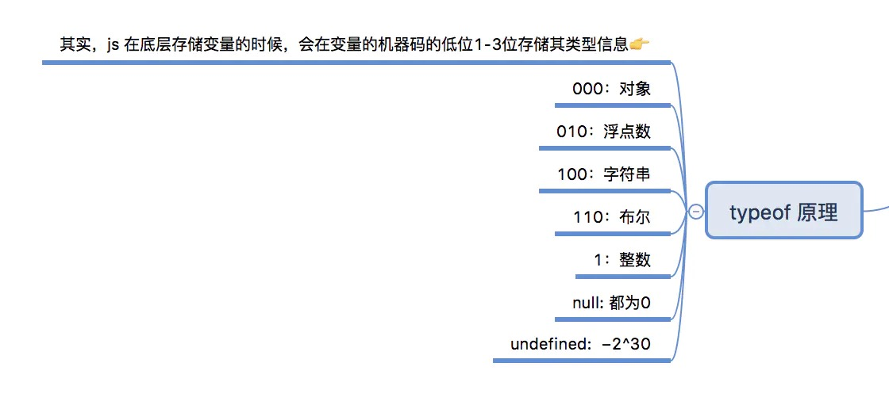

# 1：说一下对call、apply、bind三个区别？自己实现一下bind方法
在JS中，call、apply和bind是Function对象自带的三个方法，这三个方法的主要作用是改变函数中的this指向。
call、apply、bind方法的共同点和区别：
1. 三者都是用来改变函数的this对象的指向的；
2. 三者第一个参数都是this要指向的对象，也就是想指定的上下文（函数的每次调用都会拥有一个特殊值——本次调用的上下文（context）——这就是this关键字的值。）；
3. 三者都可以利用后续参数传参；
**bind 是返回对应函数，便于稍后调用；apply 、call 则是立即调用** 
apply、call 二者而言，作用完全一样，只是接受参数的方式不太一样.apply最多只能有两个参数,而call可以接受多个参数。
**实现一个bind方法**
​```
    Function.prototype.bind2 = function (context) {
        if (typeof this !== "function") {
          throw new Error("Function.prototype.bind - what is trying to be bound is not callable");
        }
        var self = this;
        var args = Array.prototype.slice.call(arguments, 1);
        var fNOP = function () {};
        var fBound = function () {
            var bindArgs = Array.prototype.slice.call(arguments);
            return self.apply(this instanceof fNOP ? this : context, args.concat(bindArgs));
        }
        fNOP.prototype = this.prototype;
        fBound.prototype = new fNOP();
        return fBound;
    }
​```
# 2：数组求和
```
    var arr = [1,2,3,4,5];
    eval(arr.join('+'))
```
eval可计算某个字符串的，其中含有要计算的 JavaScript 表达式或要执行的语句。
# 3：setstate是同步的还是异步的
当时毫不犹豫的说了异步的，因为我想的是setstate更新之后不能立马拿到结果。然而并不是。**setState在钩子函数中和在合成事件(onClick、onChange)中是异步的，在setTimeout和原生事件（addEventListener）中是同步的**
# 4: 预加载的原理
预加载：提前加载图片，当用户需要查看是可以直接从本地缓存中渲染
	  为什么要使用预加载：在网页加载之前，对一些主要内容进行加载，以提供用户更好的体验，减少等待时间。否则，如果一个页面的内容过于庞大，会出现留白。
	解决页面留白的方案：1.预加载  2.使用svg站位图片，将一些结构快速搭建起来，等待请求的数据来了之后，替换当前的占位符
	实现预加载的方法：
	 		1.使用html标签
			2.使用Image对象
			3.使用XMLHTTPRequest对象，但会精细控制预加载过程
# 5：BFC布局
BFC是css布局的一个概念，是一块独立的渲染区域，一个环境，里面的元素不会影响到外部的元素
满足下面的条件之一就能触发BFC：（脱离文档流）
		     【1】根元素，即HTML元素（最大的一个BFC）
		     【2】float的值不为none
		     【3】position的值为absolute或fixed
		     【4】overflow的值不为visible（默认值。内容不会被修剪，会呈现在元素框之外）
		     【5】display的值为inline-block、table-cell、table-caption
那你了解过**IFC FFC GFC**吗？当时我一脸懵逼？？？我就说这个还真没听过。
之后百度了一下
GFC（Grid Formatting Contexts）栅格格式化上下文和FFC（Flex Formatting Contexts）Flex格式化上下文，即分别在元素display为grid和flex、 inline-flex 时触发
IFC IFC 只有在一个块级元素中仅包含内联级别元素时才会生成。
# 6: 你了解过tcp ip协议吗？
TCP:
　　（Transmission Control Protocol 传输控制协议）是一种面向连接的、可靠的、基于字节流的传输层通信协议，由IETF的RFC 793定义。在简化的计算机网络OSI模型中，它完成第四层传输层所指定的功能，用户数据报协议（UDP）是同一层内 [1]  另一个重要的传输协议。
IP:
　　网络之间互连的协议（IP）是Internet Protocol的外语缩写 
　　网络之间互连的协议也就是为计算机网络相互连接进行通信而设计的协议
　　如今的IP网络使用32位地址，以点分十进制表示，如192.168.0.1。
　　地址格式为：IP地址=网络地址+主机地址或 IP地址=网络地址+子网地址+主机地址。
# 7： 圣杯双飞翼布局
左右两栏固定中间自适应的布局，圣杯布局实现左右两栏固宽中间自适应的方案是:在三栏的最外层包裹一个div，然后通过浮动以及定位的方式将所有栏放置到相应的位置从而达到中间自适应左右两边固定的布局。
```
<style>
        .box{
            border:1px solid red;
            width: 90%;
            min-width: 600px;
            background: gray;                       
            padding-bottom: 10px;
        }
        .box::after{
            content:"";
            display:block;
            clear:both;
        }
        .center{
            width: 100%;
            float:left;
        }
        .left{
            width: 200px;
            background: yellow;
            float:left;
            /*左浮动盒子往左边空出100%的宽度*/
            margin-left:-100%;
        }
        .right{
            width: 200px;
            background: purple;
            float:left;
            /*右侧盒子往左边空出盒子本身的宽度*/    
            margin-left:-200px;
        }
        .middle{
            background: pink;
            margin-left: 210px;
            margin-right:210px;
        }
    </style>
<div class="box">
        <div class="center">
            <div class="middle">中间栏<br><br><br><br><br><br><br><br><br></div>
        </div>
        <div class="left">左边栏<br><br></div>     
        <div class="right">右边栏<br><br></div>
        </div>
```
双飞翼布局
left、center、right三种都设置左浮动
设置center宽度为100%
设置负边距，left设置负边距为100%，right设置负边距为自身宽度
设置content的margin值为左右两个侧栏留出空间，margin值大小为left和right宽度
```
 #left, #right, #center {
    float: left;
  }
  #center {
    width: 100%;
    background: rgb(206, 201, 201);
  }
  #left {
    width: 200px;
    margin-left: -100%;
    background: rgba(95, 179, 235, 0.972);
  }
  #right {
    width: 150px;
    margin-left: -150px;
    background: rgb(231, 105, 2);
  }
  .content {
    margin: 0 150px 0 200px;
  }
  ```
  # 8：get请求传参长度的误区、get和post请求在缓存方面的区别
  误区：我们经常说get请求参数的大小存在限制，而post请求的参数大小是无限制的。
  实际上HTTP 协议从未规定 GET/POST 的请求长度限制是多少。对get请求参数的限制是来源与浏览器或web服务器，浏览器或web服务器限制了url的长度。为了明确这个概念，我们必须再次强调下面几点:

  HTTP 协议 未规定 GET 和POST的长度限制
  GET的最大长度显示是因为 **浏览器和 web服务器限制了 URI的长度**
  不同的浏览器和WEB服务器，限制的最大长度不一样
  要支持IE，则最大长度为2083byte，若只支持Chrome，则最大长度 8182byte
  补充补充一个get和post在缓存方面的区别：
  get请求类似于查找的过程，用户获取数据，可以不用每次都与数据库连接，所以可以使用缓存。
  post不同，post做的一般是修改和删除的工作，所以必须与数据库交互，所以不能使用缓存。因此get请求适合于请求缓存。

 # 9: ES6特性
  Math.trunc方法用于去除一个数的小数部分，返回整数部分
  Math.cbrt方法用于计算一个数的立方根
 
 # 10 什么是CDN和CDN的好处
 CDN:CDN是将源站内容分发至最接近用户的节点，使用户可就近取得所需内容，提高用户访问的响应速度和成功率。解决因分布、带宽、服务器性能带来的访问延迟问题，适用于站点加速、点播、直播等场景。
好处：
1、多域名加载资源
一般情况下，浏览器都会对单个域名下的并发请求数（文件加载）进行限制，通常最多有4个，那么第5个加载项将会被阻塞，直到前面的某一个文件加载完毕。
因为CDN文件是存放在不同区域（不同IP）的，所以对浏览器来说是可以同时加载页面所需的所有文件（远不止4个），从而提高页面加载速度。
2、文件可能已经被加载过并保存有缓存
一些通用的js库或者是css样式库，如jQuery，在网络中的使用是非常普遍的。当一个用户在浏览你的某一个网页的时候，很有可能他已经通过你网站使用的CDN访问过了其他的某一个网站，恰巧这个网站同样也使用了jQuery，那么此时用户浏览器已经缓存有该jQuery文件（同IP的同名文件如果有缓存，浏览器会直接使用缓存文件，不会再进行加载），所以就不会再加载一次了，从而间接的提高了网站的访问速度
3、高效率
你的网站做的再NB也不会NB过百度NB过Google吧？一个好的CDNs会提供更高的效率，更低的网络延时和更小的丢包率。
4、分布式的数据中心
假如你的站点布置在北京，当一个香港或者更远的用户访问你的站点的时候，他的数据请求势必会很慢很慢。而CDNs则会让用户从离他最近的节点去加载所需的文件，所以加载速度提升就是理所当然的了。
5、使用情况分析
一般情况下CDNs提供商（如百度云加速）都会提供数据统计功能，可以了解更多关于用户访问自己网站的情况，可以根据统计数据对自己的站点适时适当的做出些许调整。
6、有效防止网站被攻击
一般情况下CDNs提供商也是会提供网站安全服务的

# 11: 如何提高首频加载速度
1.js外联文件放到body底部，css外联文件放到head内
2.http静态资源尽量用多个子域名
3.服务器端提供html和http静态资源时最好开启gzip
4.在js,css,img等资源响应的http headers里设置expires,last-modified
5.尽量减少http requests的数量
6.js/css/html/img资源压缩
7.使用css spirtes，可以减少img请求次数
8.大图使用lazyload懒加载
9.避免404，减少外联js
10.减少cookie大小可以提高获得响应的时间
11.减少dom elements的数量
12.使用异步脚本，动态创建脚本

# 12：promise
```
const promise = new Promise((resolve, reject) =>{
  console.log('1')
  resolve()
  console.log('2')
})
promise.then(() =>{
  console.log('3')
})
console.log('4')
```
输出结果：1  2 4 3
peomise 构造函数是同步执行的
promise.then中的函数是异步执行的

# 13 vue @click.native 原生点击事件
1，给vue组件绑定事件时候，必须加上native ，不然不会生效（监听根元素的原生事件，使用 .native 修饰符）
2，等同于在自组件中：子组件内部处理click事件然后向外发送click事件：$emit("click".fn)
  如果使用router-link标签，加上@click事件，绑定的事件会无效因为：router-link的作用是单纯的路由跳转，会阻止click事件，你可以试试只用click不用native,事件是不会触发的。此时加上.native，才会触发事件
# 14 js获取event事件（关于流浪器的差异性）
```
let e = event || window.event || arguments.callee.caller.arguments[0]
window.event  // ie
e.which  // Netscape/Firefox/Opera
其中argments.callee就是函数体本身，arguments.callee.caller就是函数体的调用函数体 火狐
```
# 15vue api
Vue.filter('numfix', =>{
})
注册全局的filter方法
 
# 16 为什么要使用函数组件呢？
最重要的原因就是函数组件开销低，也就是对性能有好处，在不需要响应式和this的情况下，写成函数式组件算是一种优化方案。
# 17 关于数组的api 
push pop shift unshift some every reverse slice splice map filter reduce join concat sort forEach indexOf includes
# 18 关于对象的api
object.keys() object.prototype.toString()  object.values() object.entries() Object.is(val1,val2): 是确定两个值是否是相同的值,
# 19 Vue2.x响应式数据原理
Vue在初始化数据时，会使用Object.defineProperty重新定义data中的所有属性，当页面使用对应属性时，首先会进行依赖收集(收集当前组件的watcher)如果属性发生变化会通知相关依赖进行更新操作(发布订阅)。
# 20 Vue3.x响应式数据原理
Vue3.x改用Proxy替代Object.defineProperty。因为Proxy可以直接监听对象和数组的变化，并且有多达13种拦截方法。
# 21 position有哪些属性？
absolute relative fixed sticky(粘性定位，是fixed和relative的结合体) static（默认值 没有定位）inherit(从父元素中间继承)
# 22 typeOf 原理？
js在底层存储变量的时候，为了性能考虑用低位来存储变量类型信息。 
typeof 'hello' // string
typeof new String('hello') // Object
为什么typeof null 时object，是因为 null 全部为0  而typeof判断机器码的前三位。

# 23 0.1 + 0.2 === 0.3 吗？ 为什么？
计算机的底层都是由二进制来表示的，对于 0.1和 0.2 这种数字在用二进制储存的时候会有精度误差
# 24 img 标签间距问题的原理以及如何解决
上下间隙的原因：
img是个inline元素=>inline元素会默认产生元素代码中的换行符（也称为空白符=>也可以默认作为一个文本串）

垂直方向上产生间隙的原因：
因为img内联元素在浏览器中可能会被当做字符串看待，可能受到front-size字体大小影响，line-height同时会影响空白节点=>添加图片时候下面会多出来一条空白线就是空白节点的作用
# 25 vue sync作用
vue 修饰符sync的功能是：当一个子组件改变了一个 prop 的值时，这个变化也会同步到父组件中所绑定。
# 26 函数表达式的优先级比函数申明高一些
# 27 for 循环 和forEach循环哪个性能好一点？
在千万级别之下 forEach性能高于for。在亿级以上的量级上for循环性能高于forEach 
区别：
1：for循环按顺序遍历 forEach使用迭代器遍历
2：for循环是随机访问元素 forEach是顺序链表访问元素（数据结构）
# 28 数组原型的方法
数组原型上面的方法：map forEach filter some reduce sort splice slice includes every push unshift pop shift reverse join find findIndex set
其中改变数组的有：map filter sort splice slice concat push pop
返回新数组：concat slice

# 29 问卷总结

# 30 如何转化一个类数组对象？大致原理是怎么样？
1Array.from  2Array.prototype.slice.call() 3 定义一个新数组 通过循环push到新数组
Array.prototype.slice.call()原理
```
  var foo = {
      0: 'Java',
      1: 'Python',
      2: 'JavaScript',
      length: 3
  };
  // 因为foo对象本身并没有slice方法，所以通过call调用
  var arr = Array.prototype.slice.call(foo); // [‘Java’,’Python’,’JavaScript’]
```
function ArraySlice(start, end) { 
  CHECK_OBJECT_COERCIBLE(this, "Array.prototype.slice"); 
  var array = TO_OBJECT(this); 
  var len = TO_LENGTH(array.length); 
  var start_i = TO_INTEGER(start); 
  var end_i = len; 
  if (!IS_UNDEFINED(end)) end_i = TO_INTEGER(end); 
  if (start_i < 0) { 
  start_i  = len; 
  if (start_i < 0) start_i = 0; 
  } else { 
  if (start_i > len) start_i = len; 
  } 
  if (end_i < 0) { 
  end_i  = len; 
  if (end_i < 0) end_i = 0; 
  } else { 
  if (end_i > len) end_i = len; 
  } 
  var result = ArraySpeciesCreate(array, MaxSimple(end_i - start_i, 0)); // 先转换为数组
  if (end_i < start_i) return result; // 如果没有任何参数，直接返回数组
  if (UseSparseVariant(array, len, IS_ARRAY(array), end_i - start_i)) { 
  %NormalizeElements(array); 
  if (IS_ARRAY(result)) %NormalizeElements(result); 
  SparseSlice(array, start_i, end_i - start_i, len, result); 
  } else { 
  SimpleSlice(array, start_i, end_i - start_i, len, result); 
  } 
  result.length = end_i - start_i; 
  return result; 
} 
当没有输入参数的时候，会创建一个新数组，然后把当前数组的所有元素扔进去，最后返回这个新数组

# 31 数据类型？以及如何存值？
基本数据类型：String Null Number Undefined Boolean Symbol(es6新增) BigInt(es10新增 解决了非常大的整数的精确度问题),直接放在栈中，占据空间小，大小固定，因为经常使用，所以放入栈中储存。
引用类型：Object (Array, Date, function)同时存在栈和堆中，占据空间大，大小不固定。引用类型在栈中存储了指针，该指针指向堆中该实体的起始地址，当解释器寻找引用值时，先去栈中找地址，获得地址后找找到实体。
检查数据类型：typeof instanceof object.prototypem.toString.call()
typeof 原理：js在底层存储变量的时候，为了性能考虑用低位来存储变量类型信息。 
instanceof 原理：用于测试构造函数的prototype属性是否出现在对象原型链的任何位置。
```
instanceof (A,B) = {
    var L = A.__proto__;
    var R = B.prototype;
    if(L === R) {
        //A的内部属性(prototype属性)__proto__指向B的原型对象
        return true;
    }
    return false;
}
```

# 32['1','2','3'].map(parseInt)结果讲解
结果：[1,Nan, Nan]
将数组的每个元素传递给指定的函数处理，并返回处理后的数组，所以 ['1','2','3'].map(parseInt) 就是将字符串1，2，3作为元素；0，1，2作为下标分别调用 parseInt 函数。即分别求出 parseInt('1',0), parseInt('2',1), parseInt('3',2)的结果。
parseInt函数：以第二个参数为基数来解析第一个参数字符串，通常用来做十进制的向上取整（省略小数），特点是接受二个参数，parseInt(String, radix)。
其中radix解析字符串的基数，基数规则如下：

   1）   区间范围介于2~36之间；

   2 ）  当参数为 0，parseInt() 会根据十进制来解析；

   3 ）  如果忽略该参数，默认的基数规则：

           如果 string 以 "0x" 开头，parseInt() 会把 string 的其余部分解析为十六进制的整数；parseInt("0xf")   //15 

           如果 string 以 0 开头，其后的字符解析为八进制或十六进制的数字；parseInt("08")   //8

           如果 string 以 1 ~ 9 的数字开头，parseInt() 将把它解析为十进制的整数；parseInt("88.99f")   //88

           只有字符串中的第一个数字会被返回。parseInt("10.33")   //返回10；

           开头和结尾的空格是允许的。parseInt(" 69 10 ")   //返回69

           如果字符串的第一个字符不能被转换为数字，返回 NaN。parseInt("f")  //返回NaN  而parseInt("f"，16)  //返回15
['1','2','3'].map(parseInt)即

parseInt('1',0);radix 为 0，parseInt() 会根据十进制来解析，所以结果为 1；

parseInt('2',1);radix 为 1，超出区间范围，所以结果为 NaN；

parseInt('3',2);radix 为 2，用2进制来解析，应以 0 和 1 开头，所以结果为 NaN。

# 33 apply call bind区别
```
    var xw = {
      name : "小王",
      gender : "男",
      age : 24,
      say : function() {
          alert(this.name + " , " + this.gender + " ,今年" + this.age);
      }
    }
    var xh = {
      name : "小红",
      gender : "女",
      age : 18
    }
    xw.say();
    xw.say.call(xh)
    xw.say.apply(xh)
    xw.say.bind(xh)()
call和apply都是对函数的直接调用，而bind方法返回的仍然是一个函数
```

# 34 三栏式布局
1：flex布局
.container
  display flex
  .left 
    flex 0 0 200px
  .right 
    flex 0 0 200px
  .center
    flex 1
2: float+margin
  .left
    float left
    width 200px
    margin-left -100%
  .right
    float left
    width 200px
    margin-left 200px
  .center
    margin-left 200px
    margin-right 200px

# 35 setState是同步的还是异步的？
setState在原生事件和异步操作中是同步的，在生命周期函数中和合成事件中是异步的。

# 36 new的时候做了什么？
var obj = new Base()
1: 创建了一个新对象
2：对象obj的proto属性指向了Base的prototype上
3: 利用call/apply 为对象obj执行构造方法。

# 37 set map
set是一种叫做集合的数据结构
map是键值对的数据结构

# 38 虚拟Dom
什么是虚拟dom: 用js来模拟dom的节点
什么是diff算法： diff算法是进行虚拟节点的对比，并返回一个patch对象，用来储存二个节点的差异，最后用patc记录的信息去局部更新dom。
如图所示

diff算法的步骤：
1：用js对象表示dom树的结构，用这个树去构建一个真正的dom树。
2：当状态变更的时候，重新构造一个新的对象树，新的树和旧的树进行对比，记录二棵树之间的差异。
3：把所记录的差异应用到真正的dom树，视图更新。

# 39 vue父子组件生命周期执行顺序
加载预览过程：先后顺序为父beforeCreate->父created->父beforeMount->子beforeCreate->子created->子beforeMount->子mounted->父mounted

子组件更新过程：父beforeUpdate->子beforeUpdate->子update->父update

父组件更新过程： 父beofreUpdate -> 父update

销毁过程：父beforeDestory->子beforeDestory->子destory->父destory

# 40 Object和map的区别？
key：Object的key是一些简单的数据类型（string 整数 symbol），而map的key可以是支持js的所有数据类型。也就是说可以是object。
元素顺序： map可以按顺序插入
map迭代 get set delete size属性。
Object 则需要借助 Object.keys() 来计算

# 41 求二个数组的交集并集
1：filter
```
  var a  = [1,6,8,9]
  var b = [1,9,12,78]
  // 交集
  var c = a.filter(v =>{
    return b.indexOf(v) > -1
  })
  // a与b差集
  var d = a.filter(v =>{
    return b.indexOf(v) === -1
  })
```
2: set+filter
```
  var aa = [1,2,3,4,5]
  var bb = [2,4,6,8,10]ss
  var sa = new Set(aa);
  var sb = new Set(bb);
  // 交集
  let intersect = aa.filter(x => sb.has(x));
  // 差集
  let minus = aa.filter(x => !sb.has(x));
  // 补集
  let complement = [...aa.filter(x => !sb.has(x)), ...bb.filter(x => !sa.has(x))];
  // 并集
  let unionSet = Array.from(new Set([...a, ...b]));
  console.log("a与b的交集：", intersect);
  console.log("a与b的差集：", minus);
  console.log("a与b的补集：", complement);
  console.log("a与b的并集：", unionSet);
```

# 42 es6 -> es5
bable let const 怎么转化成var? 大概步骤？
es6 class可以看作是一个语法糖。 ES5 的构造函数 Person，对应 ES6 的 Person 类的 constructor 方法
```
class Person{
  constructor(name) {
    this.name = name
  }
  sayName() {
    return 'my name is' + this.name
  }
}
var moye = new Person('moye')
moye.sayName()
```
es5 写法
```
function Person(name) {
  this.name = name
}
Person.prototype.sayName = function () {
  return 'my name is' + this.name
}
```

# 43 双向绑定 拦截页面更新？ setter?

# 44 this.$set原理
this.$set(data, 'isChoosw', true)在new Vue（）时就注入到vue的原型。

# 45 webpack是如何解决二次引入的？

# 46 说说重绘或重排